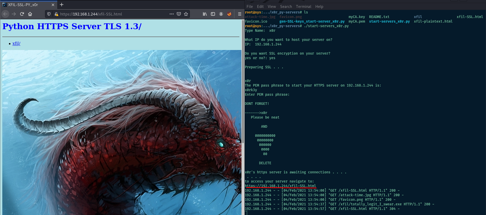

Requirements: Python3

Step 1:

Place the `x0r_py-servers/` folder and all its contents into the box you want to run your server from. This can be downloaded as a zip, or retrieved with git.

```
wget https://github.com/x0r-sys/x0r_py-servers/archive/main.zip
unzip main.zip
```
or
```
git clone https://github.com/x0r-sys/x0r_py-servers.git
cd x0r_py-servers/
```
Step 2:

Make the python scripts executable.
```
chmod +x gen-SSL-keys_start-server_x0r.py start-servers_x0r.py
```

Copy all the files you want remote access to, into the `xfil/` folder located in the main `x0r_py-servers/` directory.

Step 3:


```
./start-servers_x0r.py
```
This script will walk you through setting up a server. The options will ask you to choose between setting up a https server with SSL, or a regular http server.  This script uses default keys created by `x0r` that can be used as a quick solution in a tunnel, or local network, to encrypt data in transit with TLS 1.3, but could be exposed to decryption by users of this repo who have access to these keys.

```
./gen-SSL-keys_start-server_x0r.py
```
This script will create `fresh` SSL keys to be used with your python https server!!.
This way you can use `fresh` keys with each https instance if you want.

NOTE: While the server session is maintained, the terminal window will hang to provide http responses from the http/https server. 
Open additional windows or background the session to have access to your terminal.


Step 4:

Access your server to retrieve your files from a remote host.

If using SSL navigate to:

https://\<IP>\/xfil-SSL.html

if using a normal http server navigate to:

http://\<IP>:8000/xfil-plaintext.html

When you run the scripts it will give you the actual links to the servers

Step 5:
EXFIL !!!!!

TLDR:
Make sure you have Pyhon 3 installed, then run the scripts and follow prompts!! >
 
HËÜË|X×ß.~BÀßÚkkÕÓÏgG.ÝÁc

``x0r``
